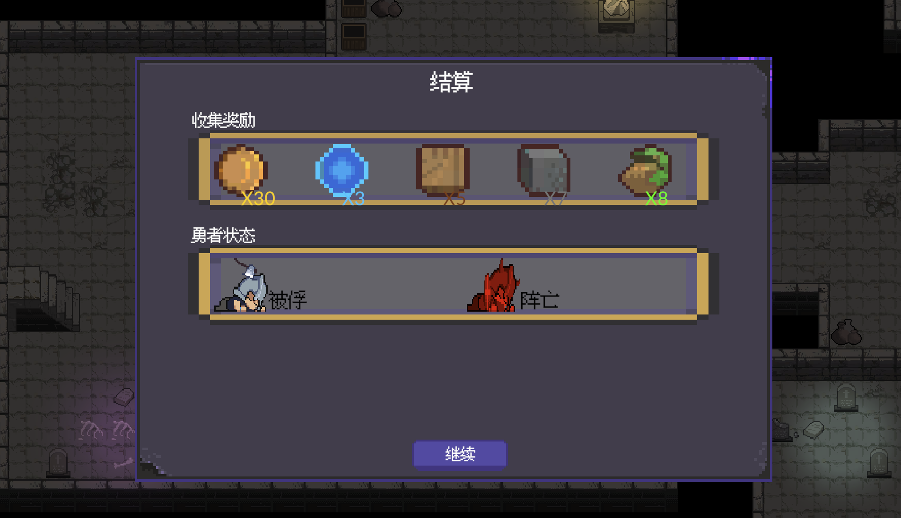

<!--
 * // -----------------------------------------------------------------------------
 * //  Copyright (c) 2025 Vanishing Games. All Rights Reserved.
 * @Author: VanishXiao
 * @Date: 2025-09-09 17:50:35
 * @LastEditTime: 2025-09-09 18:17:32
 * // -----------------------------------------------------------------------------
-->
# 本文档使用 AI 生成

# Dungeon Pension - 地牢旅店经营游戏

一个基于Unity开发的复合型游戏，结合了地牢探险、AI驱动的角色行为系统和模拟经营玩法。玩家扮演地牢管理者，需要管理冒险者团队的探险活动，同时经营自己的旅店业务。

## 🎮 游戏截图

### 游戏界面展示



## ✨ 主要特性

### 🏰 地牢探险系统
- **智能AI冒险者**: 基于GOAP (Goal-Oriented Action Planning) 的智能NPC行为系统
- **动态地牢生成**: 程序化生成的地牢关卡和挑战
- **团队管理**: 管理冒险者团队，包括招募、培养和装备分配
- **战斗系统**: 回合制战斗与实时行动相结合

### 🏪 模拟经营系统  
- **旅店经营**: 建设和管理自己的旅店设施
- **资源管理**: 管理金币、食物、装备等各种资源
- **建筑系统**: 扩建旅店，添加新的功能建筑
- **时间管理**: 昼夜循环系统影响游戏玩法

### 🤖 AI行为系统
- **GOAP行为树**: 冒险者拥有复杂的目标导向行为
- **个性化AI**: 每个冒险者都有独特的性格特征和行为模式
- **动态决策**: AI根据环境和状态做出智能决策
- **社交互动**: 冒险者之间的对话和互动系统

### 💬 对话系统
- **分支对话**: 基于NodeCanvas的复杂对话树系统
- **角色捕获**: 通过对话说服和捕获冒险者
- **故事驱动**: 丰富的剧情和角色发展

## 🛠️ 技术架构

### 核心框架
- **Unity Engine**: 游戏引擎
- **GameFramework**: 基础游戏框架，提供完整的游戏开发架构
- **GOAP System**: 目标导向行动规划系统 (CrashKonijn.Goap)
- **NodeCanvas**: 可视化行为树和对话树系统

### 主要系统组件

#### 🎯 AgentLowLevelSystem (底层AI系统)
负责角色的基础行为和状态管理：
- 移动系统 (MoveSystem)
- 视觉系统 (VisionSystem) 
- 技能系统 (SkillSystem)
- 动画系统 (Animator)
- D&D风格的能力检定系统 (DNDCheck)
- 记忆系统 (Memory)
- 屈服度系统 (Submissiveness)

#### 🎮 AgentHighLevelSystem (高层AI系统)
基于GOAP的智能决策系统：
- 目标设定和优先级管理
- 动作规划和执行
- 环境感知和适应

#### 🏛️ AdvanturersGuildSystem (冒险者公会系统)
管理冒险者团队和探险活动：
- 团队组建和管理
- 探险任务分配
- 冒险者状态追踪
- 捕获和说服机制

#### 🏗️ GridSystem (网格系统)
- 基于网格的地图管理
- 路径寻找和导航
- 建筑放置和管理

#### 🏪 MetropolisSystem (都市经营系统)
- 建筑建设和升级
- 资源生产和消费
- NPC生活模拟
- 经济系统管理

#### 💬 GalSystem (对话系统)
- 基于NodeCanvas的对话树
- 角色立绘和表情系统
- 分支剧情和选择结果
- 角色关系管理

### 数据管理
- **BlackBoard System**: 全局数据共享和状态管理
- **DataTable System**: 游戏数据配置管理
- **Event System**: 解耦的事件通信系统

## 🚀 开始使用

### 环境要求
- Unity 2022.3 LTS 或更高版本
- .NET Framework 4.8
- 支持的平台：Windows, macOS, Linux

### 依赖包
项目使用了以下主要依赖：
- GameFramework (Unity游戏框架)
- CrashKonijn GOAP (目标导向行动规划)
- NodeCanvas (行为树和对话树)
- Sirenix Odin Inspector (编辑器增强)
- DOTween (动画系统)

### 安装步骤
1. 克隆项目到本地
```bash
git clone https://github.com/your-repo/DugeonPension_OpenSource.git
```

2. 使用Unity打开项目

3. 确保所有依赖包已正确导入

4. 运行主场景开始游戏

## 🎯 游戏玩法

### 地牢模式
1. **团队管理**: 招募和培养冒险者
2. **探险规划**: 选择合适的地牢和任务
3. **实时监控**: 观察冒险者在地牢中的行为
4. **战术决策**: 在关键时刻做出战术选择

### 经营模式  
1. **设施建设**: 扩建旅店和功能建筑
2. **资源管理**: 平衡收入和支出
3. **服务提供**: 为冒险者提供住宿和服务
4. **关系维护**: 与冒险者建立良好关系

### 角色互动
1. **对话交流**: 与冒险者进行深度对话
2. **关系发展**: 通过互动提升好感度
3. **角色捕获**: 说服冒险者加入你的旅店
4. **个性化体验**: 每个角色都有独特的故事线

## 📁 项目结构

```
DugeonPension_OpenSource/
├── AgentLowLevelSystem/     # 底层AI行为系统
├── AgentHighLevelSystem/    # 高层GOAP决策系统  
├── AdvanturersGuildSystem/  # 冒险者公会管理
├── DungeonGame/            # 地牢游戏核心逻辑
├── GalSystem/              # 对话和剧情系统
├── GridSystem/             # 网格和地图系统
├── Build/                  # 建筑和经营系统
├── UI/                     # 用户界面系统
├── Audio/                  # 音频系统
├── Data/                   # 游戏数据配置
├── Event/                  # 事件系统
└── GOAP/                   # GOAP行为规划
```

## 🤝 贡献指南

我们欢迎社区贡献！如果您想为项目做出贡献，请：

1. Fork 项目
2. 创建您的功能分支 (`git checkout -b feature/AmazingFeature`)
3. 提交您的更改 (`git commit -m 'Add some AmazingFeature'`)
4. 推送到分支 (`git push origin feature/AmazingFeature`)
5. 打开一个 Pull Request

## 📄 许可证

本项目采用 MIT 许可证 - 查看 [LICENSE](LICENSE) 文件了解详情

## 📞 联系方式

- 作者: VanishXiao
- 项目链接: [https://github.com/your-repo/DugeonPension_OpenSource](https://github.com/your-repo/DugeonPension_OpenSource)

## 🙏 致谢

感谢以下开源项目和工具的支持：
- Unity Technologies
- GameFramework 团队
- CrashKonijn GOAP 系统
- NodeCanvas 可视化脚本系统
- Sirenix Odin Inspector

---

**注意**: 这是一个开源项目，仅供学习和研究使用。商业使用请联系作者获得授权。
